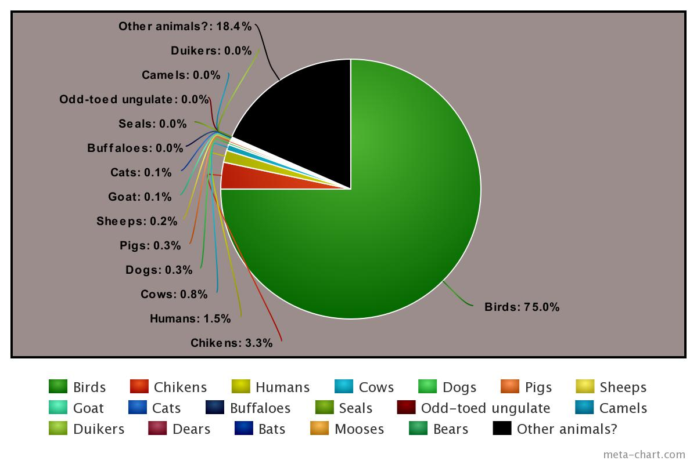

I realized I have messed up because there might be a lot of bird but...

So I think weight matters... same drill exept bring it up or down making the original number of trees time XXXXX average weight / an average human's weight

[Weight an lungs](https://www.ncbi.nlm.nih.gov/books/NBK218080/)

"in all cases the surface areas of the [lungs] vary with body mass exponents (b) near 1.0"

#### Humans: January 2nd ####

4,500,000,000 trees stay the same 4 humans

Average weight of: 195.7 pounds or 88.768 kg

https://www.medicalnewstoday.com/articles/320917.php

#### Birds: January 2nd ####  <---- most change

225,000,000,000 x (0.0575/88.768) = 225,000,000,000 x 0.00064775594 = 145,745,100 trees

57.5 grams = 0.0575 kg

https://www.beautyofbirds.com/AverageBirdWeights.htm

#### chikens: January 2nd ####

9,975,000,000 x (1.4/195.7) = 9,975,000,000 x 0.00715380684 = 71,359,200

(most used breed of chiken is Sebright chicken who weights) 1.4 pounds

https://www.google.com/search?safe=active&q=chicken+mass&stick=H4sIAAAAAAAAAONgFuLQz9U3ME4rz1ECsyyTTEu05PyL0hPzMotznXMSi4sz0zKTE0sy8_OCM1NSyxMrixcxamQnW-knZebn5KdX6udDFccno6i2ygXyAHctH1thAAAA&sa=X&ved=2ahUKEwig76DW4tLfAhXLmq0KHSi-DiwQxA0wA3oECAsQEA&biw=1381&bih=1342

#### cows: January 2nd ####

2,250,000,000 x (1800/195.7) = 2,250,000,000 x 9.19775166071 = 20,694,941,236 trees

cattle's/cow average weight: 2400 for male and 1600 for females (there are way more females than males cow in general which explains 1800 instead of 2000)

google.com

#### dogs: January 3rd ####

787,500,000 x (67.25/195.7) = 787,500,000 x 0.34363822176 = 270,615,100

67.25 pounds is the average weight of a Labrador Retriever, the most common breed of dogs

https://www.google.com/search?safe=active&biw=1381&bih=1342&ei=HpcuXIigEITKsQWUua7YCQ&q=dog+Labrador+Retriever+weight&oq=dog+Labrador+Retriever+weight&gs_l=psy-ab.3..33i22i29i30l10.6382.9328..9456...2.0..0.82.665.9......0....1..gws-wiz.......0i71j0i22i30j0i8i13i30.wU6UH1RASDw

#### Pigs: January 3rd ####

750,000,000 x (750/195.7) = 750,000,000 x 3.83239652529 = 2,874,297,400

750 pounds is the average weight of a comercial pig (the large black pig)

https://www.google.com/search?safe=active&sa=X&biw=1381&bih=1342&q=domestic+pig+mass&stick=H4sIAAAAAAAAAONgFuLQz9U3ME4rz1HiBLHMLQqTDLTk_IvSE_Myi3OdcxKLizPTMpMTSzLz84IzU1LLEyuLFzFqZCdb6Sdl5ufkp1fq50MVxyejqLbKBfIAfvVtdmIAAAA&npsic=-512&ved=0ahUKEwjL1q-s49LfAhUO7awKHXChBHMQ-BYIRA

#### Sheeps: January 3rd ####

500,000,000 x (192/195.7) = 500,000,000 x 0.98109351047 = 490,546,800

192 pounds is the average weight of a sheep

https://www.google.com/search?q=average+weight+of+a+sheep&oq=average+weight+of+a+sheep&aqs=chrome..69i57j0l5.5740j0j9&sourceid=chrome&ie=UTF-8

#### Goats: January 2nd ####

425,000,000 x (177/195.7) = 425,000,000 x 0.90444557996 = 384,389,371

177 pounds is the average weight of a goat

https://www.google.com/search?safe=active&ei=b7cvXPPpFor4tAXBipKgDw&q=what+is+the+weight+of+a+goat&oq=what+is+the+weight+of+a+goat&gs_l=psy-ab.3..0j0i22i30l5.2229.3171..3461...0.0..0.119.389.2j2......0....1..gws-wiz.......0i71j35i39.fsgaR8dAC3E

#### cats: January 4th####

375,000,000 x (8.9/192) = 375,000,000 x 0.04635416666 = 17,382,800

the average weight of cats is 8.9 pounds

https://www.google.com/search?safe=active&ei=c7cvXIO1KI_isAWNk6bIDQ&q=what+is+the+weight+of+a+cat&oq=what+is+the+weight+of+a+cat&gs_l=psy-ab.3..0l6j0i22i30l4.160276.160856..161024...0.0..0.102.301.1j2......0....1..gws-wiz.......0i71.RUqQ7brvC9c

#### : January  ####

#### Seals: January 2nd ####

57,503,000 x (200/195.7) = 57,503,000 x 1.02197240675 = 58,766,500 trees

Average weight of a any seal is about 200 pounds

https://www.google.com/search?safe=active&q=Harbor+seal&stick=H4sIAAAAAAAAAONgFuLQz9U3SE8xzlPiBLGMciwKLLU0spOt9JMy83Py0yv184vSE_Myi3Pjk3MSi4sz0zKTE0sy8_OscoG8R4zJ3AIvf9wTloqatObkNcYQLqK1CqlwsbnmlWSWVApJcfFIwd2hwSDFxQXnWTFJMPIAAMnI8bOnAAAA&sa=X&ved=0ahUKEwjGq6mZitDfAhVIT6wKHfp7DBAQri4ILA

#### : January  ####

#### : January  ####

#### : January  ####

#### : January  ####

#### : January  ####

#### : January  ####

#### : January  ####

#### : January  ####

