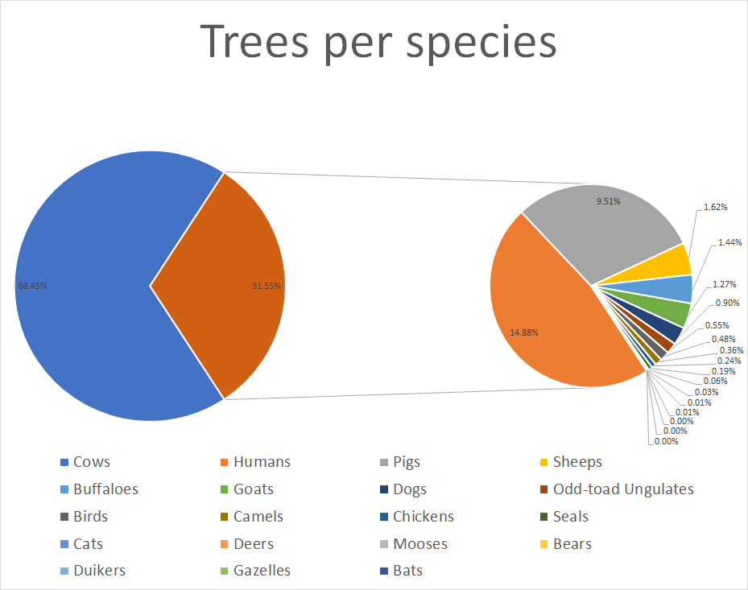

### Trees per species after part 1:

#### 225,000,000,000
Trees for all birds on Earth

#### 9,975,000,000
Trees for all chickens

#### 4,500,000,000
Trees for all humans

#### 2,250,000,000
Trees for all cows

#### 787,500,000
Trees for all dogs

#### 750,000,000
Trees for all pigs

#### 500,000,000
Trees for all sheeps

#### 425,000,000
Trees for all goats

#### 375,000,000
Trees for all cats

#### 65,625,000
Trees for all buffaloes

#### 57,503,000
Trees for all seals

#### 27,202,625
Trees for all odd-toed ungulates (horses and horse-like creatures)

#### 20,000,000
Trees for all camels

#### 6,619,500
Trees for all duikers

#### 6,278,000
trees for all deers

#### 2,000,000
Trees for all gazelles

#### 1,658,650
Trees for all bats

#### 750,000
Trees for all mooses

#### 657,250
Trees for all bears

### resulting diagram

# [To part 2 because there is a problem: Weight](https://github.com/louvrmat000/Portfolio/blob/master/Personal%20Project%20Part%202.md) #
