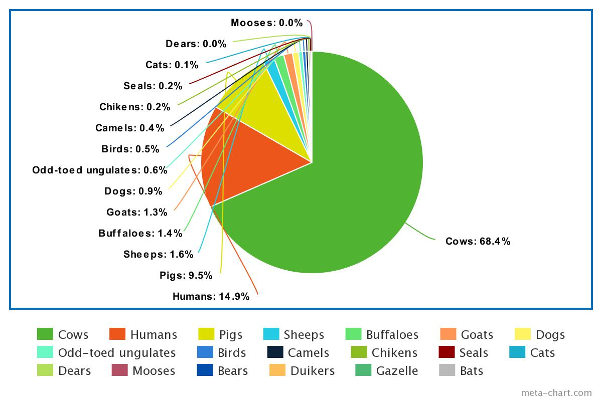

## Trees per species so far: ##

### 20,694,941,200 #### 
Trees for cows

### 4,500,000,000 #### 
Trees for humans

### 2,874,297,400 #### 
Trees for pigs

### 490,546,800 #### 
Trees for sheeps

### 435,096,800 ### 
trees for buffaloes

### 384,389,400 ### 
trees for goats

### 270,615,100 ### 
Trees for ever dog on Earth

### 166,802,000 ###
Trees for every Odd-toed ungulate (horse and horse like creatures) on Earth

### 145,745,100 ### 
Trees for every bird on Earth

### 108,329,100 #### 
Trees for camels

### 71,359,200 #### 
Trees for chikens

### 58,766,500 ### 
Trees for every seal on Earth

### 17,054,200 ### 
Trees for every cat on Earth

### 9,463,500 ### 
trees for dears

### 3,420,400 ### 
Trees for every moose on Earth

### 2,275,400 ###
Trees for every bear on Earth

### 1,150,000 ### 
Trees for every duiker on Earth

### 442,000 ### 
Trees for every gazelle on Earth

### 300 ### 
Trees for every bat on Earth

# Conclusion #

20,694,941,200 +4,500,000,000 +2,874,297,400 +490,546,800 +435,096,800 +384,389,400 +270,615,100 +166,802,000 +145,745,100 +108,329,100 +71,359,200 +58,766,500 +17,054,200 +9,463,500 +3,420,400 +2,275,400 +1,150,000 +442,000 +300 =
##### 30,234,694,400 ######

The current aproximation of the number of trees is 3 trillion or 3,000,000,000,000.

30,234,694,400 / 3,000,000,000,000 = 0.01007823146 or 1.007823146 %

Still roughtly the same overall percentage as with part 1, exept now it makes way more sense, a cow uses way more as everyone which makes sense considering how many they are and how heavy they are.

#### KEEP IN MIND THIS IS IF ALL ANIMALS ARE RESTING, it may be way more our breathing rate more than double when we, humans are exercising####

I think it is more likely for us to use 2 % as I forgot many animals and probably got something incorrect, if you know what that thing is email me @: Matthieu.louvrier@live.com

https://www.ptdirect.com/training-design/anatomy-and-physiology/acute-respiratory-responses

