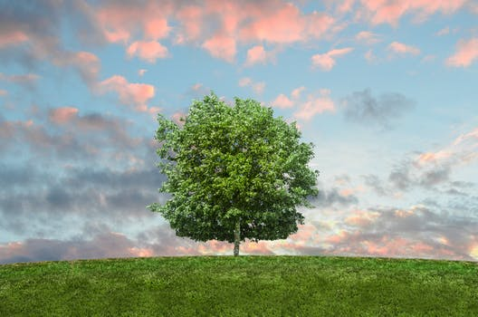

# My personal project about trees #

## The oxygen of trees and how much is it? ##

### RULES (entry 1), October 26, 2018 ###

My reasearch question is: How many trees do we need to sustain the current animal propulation?

I WILL be ignoring other photosynthetic plants.

I WILL not be subtracting oxygen for plants or vegetation as they produce their own oxygen (exept trees).

I WILL not be counting sea creatures (including crabs, lobsters, aligators, etc.) (they have algae).

I WILL not be counting insects.

I WILL not get every species of animals but rather their genus.

I WILL not be counting artic animals either.

Basically I will only be counting the Animalia kingdom with some exeptions.

My goal is to get a pretty presise answer and then compare it to the number of trees currently.

Every animal's breath will be taken as if they are at rest.

Any information here will be from google .

### Entry 2, November, 1st ###

### Criterion B: Planning ###

Checklist:

Aethetics will be added on later but they will be added.

Cost: A lot of time.

User/ Audience: Anyone who wishes to learn about trees and our plannet (6+ years old to understand).

Environmental considerations: this is for the environment, and we should strive for at least twice the number of trees here.

Function: This project's function is to make us learn about the environment, it will be hard to maintain the ideal number of trees since humans are greedy for wood however it is very possible if enought effort is put in

Materials: Wood/ paper ironically to make the poster board.

Size/Content: Yes, there will be an amount of trees REQUIERED to keep us from dying but apart from that nothing.

Impact: I want theis to inspire people to help trees and plant some, no one wants to die from suffication.

### Entry 3, October 25, 2018 ###

First up determining how much oxygen trees produce.

On average a tree produces 260 pounds of oxygen each year, or enought oxygen for two people!

[The link for this info](https://www.emaze.com/@AOQFLWIQ)

### Entry 4, October 26, 2018 ###

Second, the most important animal, humans, how much oxygen do they breathe?

7-8 liters a minute while resting this would total to about 11000. however the air is 20% oxygen and our breath is 15% oxygen so we consume 5% of it or 1/4 of the oxygen in that air. Humans consume 5% of oxygen in each breath therefore out of 100% only 5% is use, 11000 (100% of the air) x 5% (oxygen used) = 550 (what resting humans consume everyday).This means that humans consume about 550 liters of pure oxygen a day. However lets round it up to 600 litters for those who do sports or physical work.(Trees then produce about 1200 litters a day).

[The link for this info](https://www.sharecare.com/health/air-quality/oxygen-person-consume-a-day)

### Entry 5, October 26, 2018-end of forth  ###

[link to all animals](https://lib2.colostate.edu/wildlife/atoz.php?letter=ALL)

Let's first start with our precious USA:

There is about 326 Million Americans in the USA (currently) <-- about 163,000 trees

