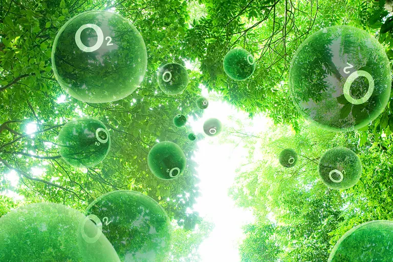
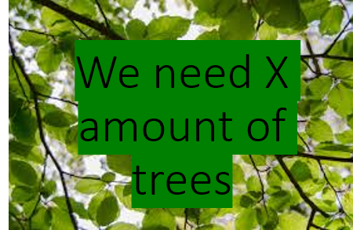

# How many trees do we need to sustain the current animal population? #

## Setup ##

### RULES (entry 1), October 26, 2018 ###

My research question is: How many trees do we need to sustain the current animal population?

I WILL be ignoring other photosynthetic plants.

I WILL not be subtracting oxygen for plants or vegetation as they produce their oxygen (except trees).

I WILL not be counting sea creatures (including crabs, lobsters, alligators, etc.) (they have algue).

I WILL not be counting insects.

My goal is not to get every species of animals but rather the ones who have an impact (at least 1,000,000 + individuals)

My goal is to get a pretty precise answer and then compare it to the number of trees currently.

Every animal's breath will be taken as if they are at rest.

Please email me at: louvrmat000@mysbisd.org if I forget something.

### Entry 2, November, 1st ###

### Criterion A: Inquiring and analysing ###

Explain and justify the need:

We need to able to say that we do or don't have enought trees for our planet, especially if we don't have enought because we would slowly run out of oxygen and many of us would asfixiate.

Identify and Prioritise research:

I need a reliable source to tell me about animals and how much are there telling me how important they are. Next comes the research about how they breathe.

Analyse existing product:

I have not found any sources or blog or websites attempting what I am doing and that is why I chose this task, so that we may know something important.

Develop a design brief:

Target Consumer: Anyone who will hear and listen

Problem Statement: We humans are in charge of Earth, most of the time we control what happens on this planet and so it is also our duty to protect it and to make sure the planet does not suffer espeicially by our hands, making it lack oxygen is the worst because we will be affecting in a bad way all multicellular organisms!

Design statement: I will continue and build up a website that desplay the ammount of oxygen needed for our current animal population.

### Criterion B: Planning ###

Develop a design specification:

Display a number of trees, has entries staiting what I did and why

Develop Design ideas:

Have a big number, small entries

have a small number but bigger entries

Present the the chosen design:

To have a big number for it is more powerfull and my entries are only for the curious ones

Develop planning drawings or diagrams:

### November 31st ###

### Criterion C: Creating the solution ###

changes: 

- I switched it from life to only animal species on land due to intervening factors like photosynthetic plant, tiny bugs and sea animals

follow the plan to make the solution:

- I am steadily working towords my goal by working a little bit by a little bit

Demonstrating technical skills:

- I have perseverance because I did want to give up multiple times

- I have reasearching skill because this information isn't easy to find

- I can build a potfolio from nothing on a website.

Construct a logical plan:

- work with big animal population, work my way down so I don't spend more time than needed on something with a population 1,000,000 while I haven't done humans.

- get as close to the result as possible and make my personal project poster board.

### Criterion D: Evaluating ###

Impact of the solution:

- Raise awarness to potential lack of trees

How could it be improved:

- adding other photosynthetic plants

- adding more species

Success of the solution:

- It might get people to care about and plant trees

Design, Testing, Methods Development, Planning:

- I designed this website

- I tested multiple sources and found the best

- My methods could be improved however with my reasources I think this is the best.

- I planned to do the biggest animals first then work my way down

## Trees, Oxygen, and animals ##

### Entry 3, October 25, 2018 ###

First up determining how much oxygen trees produce.

On average a tree produces 260 pounds of oxygen each year, or enough oxygen for two people.

[The link for this info](https://www.emaze.com/@AOQFLWIQ)

### Entry 4, October 26, 2018 ###

Second, the most important animal, humans, how much oxygen do they breathe?

Humans use 7-8 liters a minute while resting. However since the air is 20% oxygen and our breath is 15% oxygen, we consume 5% of it or 1/4 of the oxygen in that air therefore out of 100% of air swallowed only 5% is used. 11000 (100% of the air breathed in) x 5% (oxygen used) = 550 liters.

A tree produces 260 pounds of oxygen each year. A human uses 550 litters a day x 365 (days in a year) is about 200750 liters a year. A tree produces enough oxygen for two people, so a tree produces about 401500 liters (200750 x 2) a year or 1100 litters (401500 / 360) a day.

[The link for this info](https://www.sharecare.com/health/air-quality/oxygen-person-consume-a-day)

80 (average human heartbeat per minute) / 20 (average human breathing rate) = 4 (ratio of repiration rate to heart beat)
Only be used when I don't know the repiration rate.;

https://biology.stackexchange.com/questions/20703/what-is-the-ratio-of-breathing-rate-to-heart-rate

### Entry 5, October 26, 2018 ###

#### General info ####

There are 3.04 trillion or 3,000,000,000,000 trees in the world.

There are about 7.6 billion or 7,600,000,000 people on Earth now however, the human population is growing rapidly and it is estimated to be 9 billion in as soon as 2050 so I will use 9 billion rather than 7.6 billion. Since for every human half a tree is needed, 9,000,000,000 (number of humans estimated for 2050) x 0.5 (trees per human ratio) = 4,500,000,000 or 4.5 billion trees.

### Entry 7, december 2nd - december 9th 2018###

#### Most abundant mamals ####

Today there are about 1.5 billion cows on Earth who breathe 60 times per minute. 60 (breathing rate of cows) / 20 (breathing rate of humans) = 3. Since there is half tree per human: 0.5 (tree per human) x 1.25 (increase of breathing rate between cows and humans) = 1.5 (tree per cow). 1,500,000,000 (number of cows) x 1.5 (tree per cow) = 2,250,000,000 or 2.25 billion trees (for every cow on Earth).

https://www.quora.com/How-many-cows-are-there-in-the-world

www.coolcows.com.au/go-on-alert/cow-breathing-rate.htm

There are about 2 billion pigs who breathe 15 times per minute. 15 (breathing rate of pigs) / 20 (breathing rate of humans) = 0.75. Since there is half tree per human: 0.5 (tree per human) x 0.75 (increase of breathing rate between pigs and humans) = 0.375 (tree per pig). 2,000,000,000 (number of pigs) x 0.375 (tree per pig) = 750,000,000 or 750 million trees (for every pig on Earth).

www.animalethics.org.uk/i-ch7-3-pigs.html

https://articles.extension.org/pages/55505/what-is-the-normal-heart-and-repiratory-rate-for-pigs

There are about 19 billion chickens on Earth who breathe 21 times per minute. 21 (breathing rate of chickens) / 20 (breathing rate of humans) = 1.05. Since there is half tree per human: 0.5 (tree per human) x 1.05 (increase of breathing rate between chickens and humans) = 0.525 (tree per chicken). 19,000,000,000 (number of chickens) x 0.525 (tree per chicken) = 9,975,000,000 or 9.975 billion trees (for every chicken on Earth).

https://www.worldatlas.com/articles/how-many-chickens-are-there-in-the-world.html

https://www.animallaw.info/article/brief-summary-biology-and-behavior-chicken

There are about 1 billion sheeps in the world who breath at a rate of 20 breaths per minute. Since sheep's breathing rate is the same as humans the tree to sheep ratio is 0.5 so 1,000,000,000 x 0.5 = 500,000,000 or 500 million tree (for every sheep on Earth).

https://www.quora.com/How-many-sheep-are-there-in-the-world

https://www.valleyvet.com/Library/dr-hickman-assessing-horse-vital-signs.html

There are about 16 million camels (and dromedaries) who each breathe about 50 times per minute. 50 (breathing rate of camels) / 20 (breathing rate of humans) = 2.5. Since there is half tree per human: 0.5 (tree per human) x 2.5 (increase of breathing rate between camels and humans) = 1.25 (tree per camel). 16,000,000 (number of camels) x 1.25 (tree per camel) = 20,000,000 or 20 million trees (for every camel on Earth).

https://wonderopolis.org/wonder/what-is-a-dromedary

www.ecosmagazine.com/?act=view_file&file_id=EC61p15.pdf

There are about 850 million goats in the World who breath at an average of 20 breaths per minute. As goats' repiration rate is the same as humans' they both use half a tree each. 850,000,000 (number of goats) x 0.5 (rate of tree per goat) = 425,000,000 or 425 million trees are needed for every goat on Earth.

https://en.wikipedia.org/wiki/List_of_even-toed_ungulates_by_population

https://www.dummies.com/home-garden/hobby-farming/raising-goats/how-to-take-your-goats-temperature-pulse-and-respiration/

There are about 175 million buffaloes on Earth that breathe at an average of 15 breaths per minute. 15 (breathing rate of buffaloes) / 20 (breathing rate of humans) = 0.75. Since there is half tree per human: 0.5 (tree per human) x 0.75 (increase of breathing rate between buffaloes and humans) = 0.375 (tree per buffalo). 175,000,000 (number of buffaloes) x 0.375 (tree per buffalo) = 65,625,000 or 65.625 million trees (for every buffalo on Earth).

https://en.wikipedia.org/wiki/List_of_even-toed_ungulates_by_population

https://www.quora.com/How-many-times-do-different-animals-breathe-in-1-minute

There are about 12,556,438 deers on Earth who breath 20 times per minute. As deers respiration rate is the same as humans' they both use half a tree each. 12,556,438 (number of deers) x 0.5 (rate of tree per deer) = 6,278,219 or 6.278219 million trees are needed for every deer on Earth.

https://en.wikipedia.org/wiki/List_of_even-toed_ungulates_by_population

https://www.wideopenspaces.com/11-fawn-facts-might-not-known-pics/

There are about 13.239 million duikers on Earth who breath 20 times a minute. Since duiker's breathing rate is the same as humans the tree to duiker ratio is 0.5 so 13,239,000 x 0.5 = 6,619,500 or about 6.6 million tree (for every duiker on Earth).

https://en.wikipedia.org/wiki/List_of_even-toed_ungulates_by_population

There are about 5 million gazelles/ antelopes on Earth who breathe about 16 breathes per minute while resting. 16 (breathing rate of gazelles) / 20 (breathing rate of humans) = 0.8. Since there is half tree per human: 0.5 (tree per human) x 0.8 (increase of breathing rate between gazelles and humans) = 0.4 (tree per gazelle). 5,000,000 (number of gazelles) x 0.4 (tree per gazelle) = 2,000,000 or 2 million trees (for every gazelle on Earth).

https://en.wikipedia.org/wiki/List_of_even-toed_ungulates_by_population

https://www.vaajournal.org/article/S1467-2987(17)30200-3/fulltext

There are about 1.5 million mooses on Earth who breathe about 20 times per minute. As a mose's respiration rate is the same as humans' they both use half a tree each. 1,500,000 (number of mooses) x 0.5 (rate of tree per moose) = 750,000 or 0.75 million trees are needed for every moose on Earth.

https://en.wikipedia.org/wiki/List_of_even-toed_ungulates_by_population

https://www.ncbi.nlm.nih.gov/pubmed/6530720

### Entry 8, december 2nd - december 9th 2018###

#### Most ambundent carnivorans ####

There are about 900 million dogs in the world who breath 35 times per minute. 35 (breathing rate of dogs) / 20 (breathing rate of humans) = 1.75. Since there is half tree per human: 0.5 (tree per human) x 1.75 (increase of breathing rate between dogs and humans) = 0.875 (tree per dog). 900,000,000 (number of dogs) x 0.875 (tree per dog) = 787,500,000 or 787.5 million trees (for every dog on Earth).

https://www.quora.com/How-many-dogs-are-there-in-the-world

https://vcahospitals.com/know-your-pet/home-breathing-rate-evaluation

There are about 600 million cats in the world who breathe 25 times per minute. 25 (breathing rate of cats) / 20 (breathing rate of humans) = 1.25. Since there is half tree per human: 0.5 (tree per human) x 1.25 (increase of breathing rate between cats and humans) = 0.625 (tree per cat). 600,000,000 (number of cats) x 0.625 (tree per cat) = 375,000,000 or 375 million trees (for every cat on Earth).

https://www.quora.com/How-many-cats-are-in-the-world

www.vetstreet.com/dr-marty-becker/check-your-cats-vital-signs-at-home

There are about 84.641 million seals on Earth. Seals have a heart rate of 108.7 on average. We know that to go from heart rate to repiration rate, we need to divide by 4. 108.7 (Seals' heart rate) / 4 (respiration rate / heart rate) = 27.175 (Seals respiration rate). 27.175 (breathing rate of seals) / 20 (breathing rate of humans) = 1.35875. Since there is half tree per human: 0.5 (tree per human) x 1.35875 (increase of breathing rate between seals and humans) = 0.679375 (tree per seal). 84.641,000 (number of seals) x 0.679375 (tree per seal) = 57,502,979.375 or about 57.502979375 million trees (for every seal on Earth).

https://en.wikipedia.org/wiki/List_of_carnivorans_by_population

https://www.ncbi.nlm.nih.gov/pubmed/10070067

There are about 1.195 million bears on Earth who breathe 22 times per minute. 22 (breathing rate of bears) / 20 (breathing rate of humans) = 1.1. Since there is half tree per human: 0.5 (tree per human) x 1.1 (increase of breathing rate between bears and humans) = 0.55 (tree per bear). 1,195,000 (number of bears) x 0.55 (tree per bear) = 657,250 or 0.65725 million trees (for every bear on Earth).

https://en.wikipedia.org/wiki/List_of_carnivorans_by_population

http://wildpro.twycrosszoo.org/S/0MCarnivor/ursidae/ursus/Ursus_maritimus/10Ursus_maritimusDetPhy.htm

### Entry 9, December 30th-31st 2018###

#### Bats ####

There are about 1,326,920 or 1.32692 million bats in the world. bats have a heart rate of 200 on average. We know that to go from heart rate to repiration rate, we need to divide by 4. 200 (bats' heart rate) / 4 (respiration rate / heart rate) = 50 (bats respiration rate). 50 (breathing rate of bats) / 20 (breathing rate of humans) = 2.5. Since there is half tree per human: 0.5 (tree per human) x 2.5 (increase of breathing rate between bats and humans) = 1.25 (tree per bat). 1,326,920 (number of bats) x 1.25 (tree per bat) = 1,658,650 or 1.65865 million trees (for every bat on Earth).

https://en.wikipedia.org/wiki/List_of_bats_by_population

https://www.cardiovascularbusiness.com/topics/lipids-metabolic/bat-can-vary-heart-rate-800-bpm

###  Entry 10, December 31st###

####  Odd-toed ungulates (horse like creature) ####

They will be counted as one due to their similarness

There are about 108,810,500 or 108.8105 million Odd-toed ungulates who breath 10 times per minute. 10 (breathing rate of Odd-toed ungulates) / 20 (breathing rate of humans) = 0.5. Since there is half tree per human: 0.5 (tree per human) x 0.5 (increase of breathing rate between Odd-toed ungulates and humans) = 0.25 (tree per Odd-toed ungulate). 108,810,500 (number of Odd-toed ungulate) x 0.25 (tree per Odd-toed ungulate) = 27,202,625 or 27.202625 million trees (for every Odd-toed ungulate on Earth).

https://en.wikipedia.org/wiki/List_of_odd-toed_ungulates_by_population

https://articles.extension.org/pages/27755/temperature-pulse-and-respiration-in-a-horse

### Entry 11, December 31st###

#### Birds ###

There are about 300 billion birds today who breathe 30 times per minute. 30 (breathing rate of birds) / 20 (breathing rate of humans) = 1.5. Since there is half tree per human: 0.5 (tree per human) x 1.5 (increase of breathing rate between birds and humans) = 0.75 (tree per bird). 300,000,000,000 (number of bird) x 0.75 (tree per bird) = 225,000,000,000 or 225 billion trees (for every bird on Earth).

https://www.amnh.org/explore/ology/earth/ask-a-scientist-about-our-environment/how-big-is-the-bird-population

https://www.merckvetmanual.com/exotic-and-laboratory-animals/pet-birds/management-of-pet-birds

### Entry 11, ###

####  ####

### Sources ###

[link to all animals](https://lib2.colostate.edu/wildlife/atoz.php?letter=ALL)

[Wikipedia knows everything](https://en.wikipedia.org/wiki/Lists_of_organisms_by_population)

https://climatekids.nasa.gov/tree-rings/

https://www.thoughtco.com/how-much-oxygen-does-one-tree-produce-606785

https://www.sharecare.com/health/air-quality/oxygen-person-consume-a-day

https://www.emaze.com/@AOQFLWIQ
