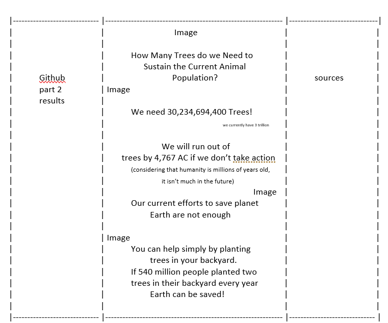

#### Dimensions:

36" x 48"

according to: elmers.com/product/detail/902090

Now as my number does not seem to significant, I will try to convert it into more people as I doubt many other species will grow.

### How many more humans?

The U.N. predicts that in 2100 there will be 11,500,000,000 people and that the world population will stop growing. 

https://www.npr.org/sections/goatsandsoda/2017/06/23/533549231/future-humans-how-many-of-us-will-there-be

### How many less trees can we have?

We loose an estimate of 18 million acres (or 28,125 square miles) of trees every year.

https://www.livescience.com/27692-deforestation.html

In a healthy forest there are about 60 trees per acre. Since we loose 18 million acres per year: 18,000,000 x 60 = 1,080,000,000. So we loose 1,080,000,000 or 1.08 billion trees every year. If the U.N. estimates that there will be 11.5 billion people:

www.sbcounty.gov/calmast/sbc/html/healthy_forest.asp

2,969,765,300,000 - (2,500,000,000 / 2 (breathing rate)) (because I used 9 billion people I will add 2.5 billion) = 2,968,500,000,000

There are 2,968,500,000,000 or 2.9685 trillion 'extra' trees left, let's find out how long it takes for them to be eradicated due to deforesation.

### Effect of deforestation, the end of all trees 

2,968,500,000,000 - 1,080,000,000X = 0 ; 2,968,500,000,000 = 1,080,000,000X ; 2,968,500,000,000 / 1,080,000,000 = X ; 2748.6 = X 

All of these "extra" trees will be gone in 2,748 years. However this doom will surely come before my calculated date as with more people, there will be a higher demand of wood! (Keep in mind that this is also if all humans are resting, and if the world population stagnates at 11.5 billion).

### RESULTING in 2,748 years of trees left, it is only about 100 generations ahead! ###

